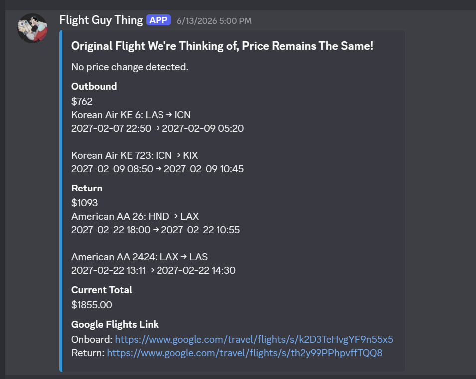
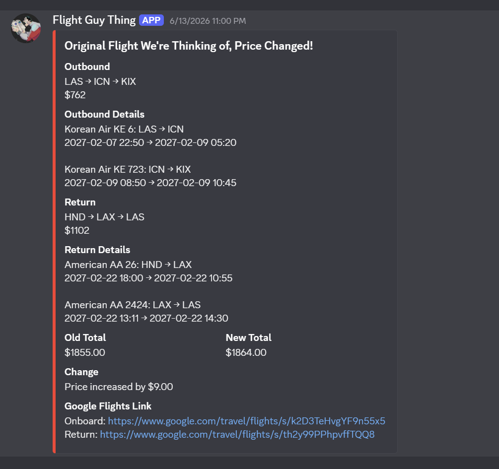
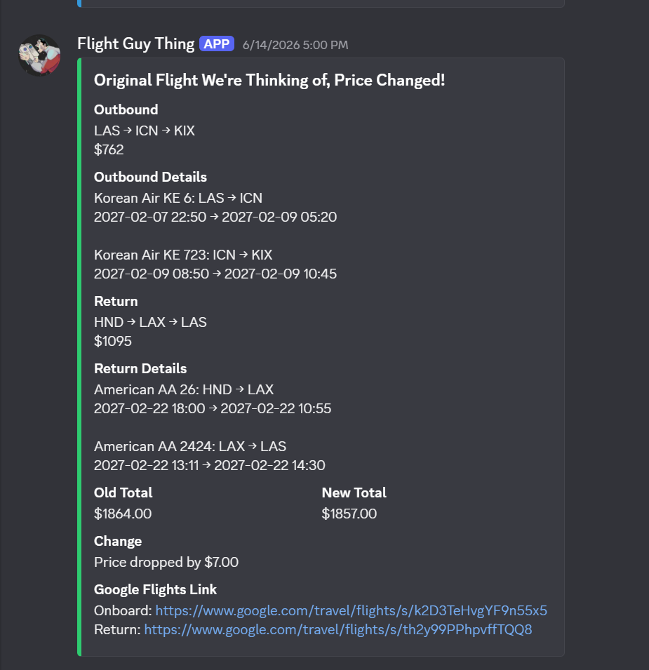

# FLIGHT TRACKER LOG

I built this flight price tracker to monitor specific airlines and itineraries.
My friends and I were planning a trip and wanted to keep an eye on flights with a layover in Korea.

Since we were all chronically online, I built a Python bot and scheduled it to check prices every six hours and send updates to our Discord server.

The bot's features include:

- Tracking price changes with color-coded Discord messages:
    - Red: the price increased.
    - Green: the price dropped.
    - Blue: the price stayed the same.
- Showing airline information, flight numbers, and stops.
- Including Google Flights links for the selected itineraries.

The bot retrieves Google Flights data through SerpApi, matches the results to the selected itineraries, and compares the total price with the previous saved price.

# FLIGHT_TRACKER
